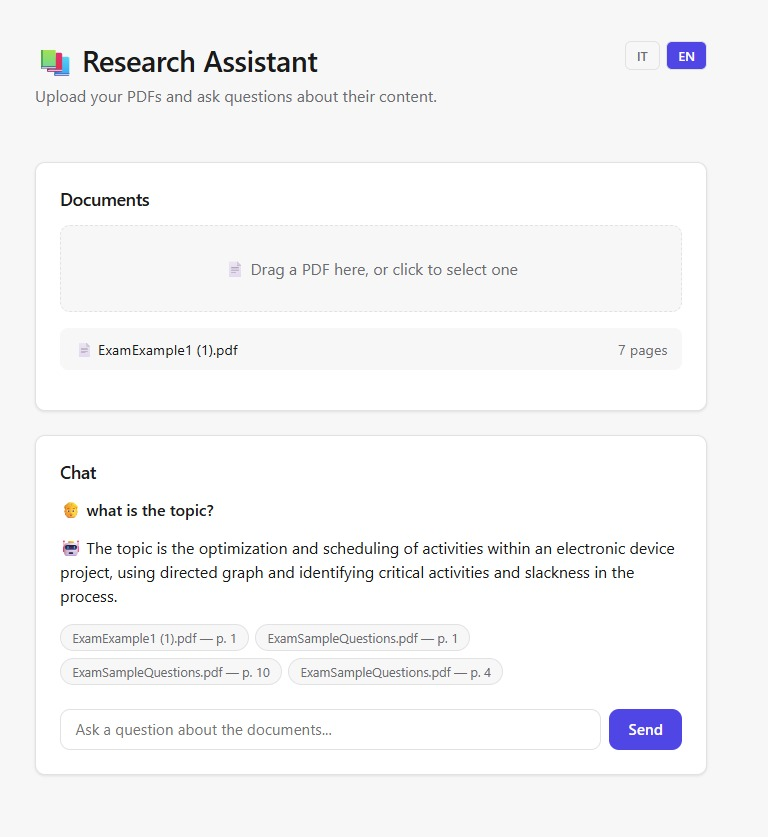

# 📚 Research Assistant

A RAG (Retrieval-Augmented Generation) application that lets you upload PDF documents and ask questions about them in natural language, receiving answers with precise citations of file name and page number.



---

## 🎯 What it does

1. **Upload** one or more PDFs through the web interface
2. The system **indexes** them: extracts the text, splits it into chunks, generates semantic embeddings, and stores them in a vector database
3. **Ask a question** in natural language
4. The system retrieves the most relevant passages via semantic search and generates an answer **citing the exact source** (file name + page number)

---

## 🏗️ Architecture

```
┌──────────────┐      ┌──────────────┐      ┌──────────────────┐
│  React + TS   │ ───▶ │   FastAPI     │ ───▶ │  PostgreSQL       │
│  (frontend)   │ ◀─── │   (backend)   │ ◀─── │  + pgvector       │
└──────────────┘      └──────┬───────┘      └──────────────────┘
                              │
                              ▼
                      ┌──────────────┐
                      │  Ollama (LLM) │
                      │  local        │
                      └──────────────┘
```

**RAG flow:**
1. PDF upload → page-by-page text extraction → chunking → embedding (`sentence-transformers`) → storage in Postgres/pgvector
2. User question → question embedding → cosine similarity search over chunks → prompt construction with retrieved context → answer generation via LLM → answer + deduplicated sources

---

## 🛠️ Tech stack

**Backend**
- Python 3.11+ / FastAPI
- PostgreSQL + pgvector (vector database)
- SQLAlchemy (ORM)
- sentence-transformers (embeddings, `all-MiniLM-L6-v2` model, local and free)
- Ollama (local LLM, `phi3` model)
- pytest (automated testing)

**Frontend**
- React 18 + TypeScript
- Vite
- react-dropzone (drag & drop upload)
- react-i18next (IT/EN multilingual interface)
- axios

**Infrastructure**
- Docker + Docker Compose (backend + frontend + database orchestration)
- Git

---

## 🚀 Running it locally

### Prerequisites

- [Docker Desktop](https://www.docker.com/products/docker-desktop/)
- [Ollama](https://ollama.com/download) installed, with the model pulled:
  ```bash
  ollama pull phi3
  ```

### Startup

```bash
git clone https://github.com/YOUR-USERNAME/research-assistant.git
cd research-assistant
docker compose up --build
```

After a few minutes (the first run downloads images and installs dependencies), the app will be available at:

- **Frontend**: http://localhost:5173
- **Backend (API docs)**: http://127.0.0.1:8000/docs

Database tables are created automatically on the backend's first startup.

### Usage

1. Drag a PDF into the upload area
2. Wait for indexing (a few seconds, depending on document length)
3. Ask a question in the chat about the document's content
4. The answer will arrive with clickable badges indicating the source file and page

---

## 🧪 Testing

The backend includes an automated test suite with `pytest`, covering:
- API health check
- PDF upload and ingestion (document, chunk, and embedding creation in the database)
- Semantic retrieval (finding the most relevant chunks for a question)
- Source citation deduplication
- Full RAG pipeline, with the LLM call mocked for fast, deterministic tests

To run them:

```bash
cd backend
python -m venv venv
venv\Scripts\Activate   # on Windows
pip install -r requirements.txt
pytest -v
```

*(requires a reachable test Postgres database — see the comments in `app/tests/conftest.py` for configuration)*

---

## 💡 Technical decisions and what I learned

- **pgvector instead of a dedicated vector DB** (Pinecone, Weaviate): I chose to keep everything in PostgreSQL with the pgvector extension to maintain a single source of truth for both relational and vector data, avoiding an extra external service for a project of this scale.
- **Chunking with overlap**: chunks are split with character overlap to avoid cutting relevant sentences exactly at the boundary between chunks, improving retrieval quality.
- **Source deduplication**: retrieval can return multiple chunks from the same page; the sources shown to the user are deduplicated while preserving relevance order.
- **Local LLM (Ollama) instead of a paid API**: for development and demo purposes I chose a local model (`phi3` via Ollama) to keep costs at zero and avoid depending on API keys — at the cost of response speed compared to a dedicated cloud service.
- **Mocking the LLM in tests**: to keep the test suite fast and deterministic, the language model call is replaced with a fake response in the RAG pipeline tests, while semantic retrieval is tested with real embeddings.

---

## 📌 Possible future extensions

- Token-by-token response streaming
- User authentication and private documents per account
- Highlighting the exact cited passage inside the PDF
- Multi-format support (docx, txt, markdown)
- Cloud deployment with a managed LLM (e.g. Anthropic Claude, OpenAI)

---

## 📄 License

This project was built for learning and portfolio purposes.
